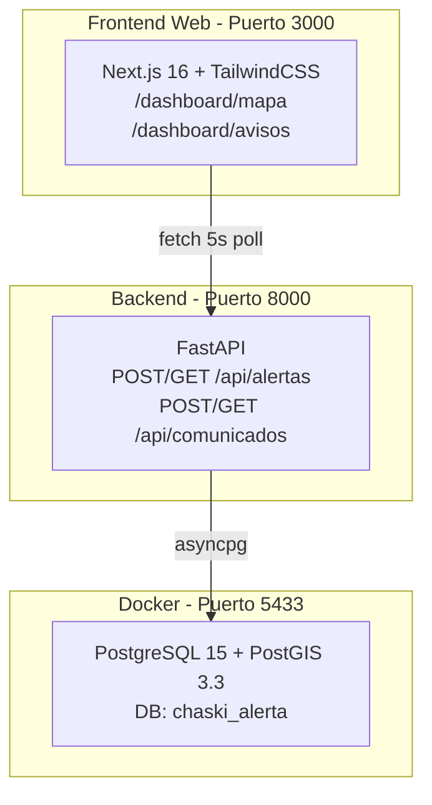

# Chaski Alert — Walkthrough de Implementación

## Resumen

Se implementó el **MVP completo** del sistema Chaski Alert (Fases 1-3): infraestructura Docker+PostGIS, backend FastAPI con 4 endpoints, y frontend web Next.js con mapa Leaflet y panel de comunicados. Todo con identidad visual intercultural andina y bilingüismo Español/Kichwa.

---

## Arquitectura Implementada



---

## Archivos Creados

### Infraestructura
| Archivo | Propósito |
|---|---|
| [docker-compose.yml](file:///c:/Users/trejo/Desktop/Semestre%20IX/Interculturalidad/Parcial%20I/Proyecto/INTER_PROYECTO/docker-compose.yml) | PostGIS 15-3.3 en puerto 5433 |
| [init.sql](file:///c:/Users/trejo/Desktop/Semestre%20IX/Interculturalidad/Parcial%20I/Proyecto/INTER_PROYECTO/Backend/init.sql) | Tablas alertas + comunicados + datos ejemplo |

### Backend (FastAPI)
| Archivo | Propósito |
|---|---|
| [main.py](file:///c:/Users/trejo/Desktop/Semestre%20IX/Interculturalidad/Parcial%20I/Proyecto/INTER_PROYECTO/Backend/main.py) | 4 endpoints REST + CORS + Pydantic |
| [requirements.txt](file:///c:/Users/trejo/Desktop/Semestre%20IX/Interculturalidad/Parcial%20I/Proyecto/INTER_PROYECTO/Backend/requirements.txt) | Dependencias Python |
| [.env](file:///c:/Users/trejo/Desktop/Semestre%20IX/Interculturalidad/Parcial%20I/Proyecto/INTER_PROYECTO/Backend/.env) | Config de conexión |

### Frontend Web (Next.js + TypeScript)
| Archivo | Propósito |
|---|---|
| [globals.css](file:///c:/Users/trejo/Desktop/Semestre%20IX/Interculturalidad/Parcial%20I/Proyecto/INTER_PROYECTO/Frontend/cliente_web/src/app/globals.css) | Design system andino completo |
| [layout.tsx](file:///c:/Users/trejo/Desktop/Semestre%20IX/Interculturalidad/Parcial%20I/Proyecto/INTER_PROYECTO/Frontend/cliente_web/src/app/dashboard/layout.tsx) | Sidebar con navegación bilingüe |
| [mapa/page.tsx](file:///c:/Users/trejo/Desktop/Semestre%20IX/Interculturalidad/Parcial%20I/Proyecto/INTER_PROYECTO/Frontend/cliente_web/src/app/dashboard/mapa/page.tsx) | CU-05: Mapa de incidencias con polling |
| [avisos/page.tsx](file:///c:/Users/trejo/Desktop/Semestre%20IX/Interculturalidad/Parcial%20I/Proyecto/INTER_PROYECTO/Frontend/cliente_web/src/app/dashboard/avisos/page.tsx) | CU-08/09: Formulario + muro de avisos |
| [MapView.tsx](file:///c:/Users/trejo/Desktop/Semestre%20IX/Interculturalidad/Parcial%20I/Proyecto/INTER_PROYECTO/Frontend/cliente_web/src/components/MapView.tsx) | Componente Leaflet con dark tiles |
| [ComunicadoCard.tsx](file:///c:/Users/trejo/Desktop/Semestre%20IX/Interculturalidad/Parcial%20I/Proyecto/INTER_PROYECTO/Frontend/cliente_web/src/components/ComunicadoCard.tsx) | Card de comunicado animada |

---

## Capturas de Pantalla

### Mapa de Incidencias (CU-05)


### Comunicados / Willaykuna (CU-08/09)


---

## Pruebas Realizadas

| Prueba | Resultado |
|---|---|
| `GET /` (health check) | ✅ `{"sistema": "Chaski Alert", "estado": "Activo"}` |
| `POST /api/alertas` con coordenadas Quito | ✅ Alerta creada con id=1, PostGIS Point |
| `GET /api/alertas` | ✅ Retorna array con coordenadas extraídas via ST_X/ST_Y |
| `POST /api/comunicados` | ✅ Comunicado creado con timestamp |
| `GET /api/comunicados` | ✅ 3 comunicados (2 ejemplo + 1 test) ordenados DESC |
| Mapa Leaflet renderiza markers | ✅ Pin rojo visible en Quito |
| Auto-refresh del mapa (5s) | ✅ Polling activo con timestamp |
| Formulario de comunicados | ✅ Publicación y refresco automático |
| Navegación sidebar bilingüe | ✅ Active state + Kichwa labels |

---

## Cómo Levantar el Sistema

```bash
# 1. Base de datos (desde la raíz del proyecto)
docker-compose up -d

# 2. Backend (desde /Backend)
.\venv\Scripts\python.exe -m uvicorn main:app --host 0.0.0.0 --port 8000 --reload

# 3. Frontend Web (desde /Frontend/cliente_web)
npm run dev
```

- **API Docs:** http://localhost:8000/docs
- **Panel Web:** http://localhost:3000/dashboard/mapa

---

## Pendiente: Fase 4 — App Móvil Expo

Para implementar el cliente móvil necesitas:
1. Instalar Expo CLI: `npm install -g expo-cli`
2. Crear proyecto: `npx create-expo-app@latest ./` en `Frontend/cliente_movil/`
3. Instalar dependencias: `npx expo install expo-location @react-navigation/native @react-navigation/bottom-tabs`
4. Implementar SOSScreen (botón rojo + GPS) y MuroScreen (FlatList)
5. Probar con Expo Go en tu teléfono

> [!TIP]
> El backend ya está preparado con CORS para Expo. Solo necesitas apuntar los `fetch()` a la IP de tu computadora en la misma red WiFi (ej: `http://192.168.x.x:8000`).
